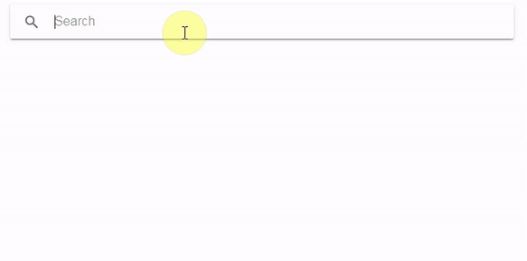

# Ionic/Angular mapbox geocoding address lookup
This is an Ionic/Angular project showcasing an address lookup implementation powered by Mapbox Geocoding API.

More information about Mapbox Geocoding API can be found at:

https://docs.mapbox.com/help/how-mapbox-works/geocoding/



## Installation

In the project folder, type:
```
npm install
```

If you don't have Ionic, install it:
```
npm install -g ionic
```

## Usage

In the project folder, type:
```
ionic serve
```
